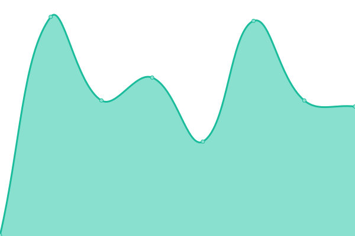

# [📈 Live Status](https://status.wrservices.link): <!--live status--> **🟩 All systems operational**

This repository contains the open-source uptime monitor and status page for [White Ravens](https://whiteravens.net), powered by [Upptime](https://github.com/upptime/upptime).

With [Upptime](https://upptime.js.org), you can get your own unlimited and free uptime monitor and status page, powered entirely by a GitHub repository. We use [Issues](https://github.com/whiteravens20/status.wrservices.link/issues) as incident reports, [Actions](https://github.com/whiteravens20/status.wrservices.link/actions) as uptime monitors, and [Pages](https://status.wrservices.link) for the status page.

<!--start: status pages-->
<!-- This summary is generated by Upptime (https://github.com/upptime/upptime) -->
<!-- Do not edit this manually, your changes will be overwritten -->
<!-- prettier-ignore -->
| URL | Status | History | Response Time | Uptime |
| --- | ------ | ------- | ------------- | ------ |
|  [White Ravens Home](https://whiteravens.net) | 🟩 Up | [white-ravens-home.yml](https://github.com/whiteravens20/status.wrservices.link/commits/HEAD/history/white-ravens-home.yml) | 

 128ms
     
 | 

<a href="https://status.wrservices.link/history/white-ravens-home">100.00%</a>
    

|  [Dokumentacja WR](https://wrservices.link) | 🟩 Up | [dokumentacja-wr.yml](https://github.com/whiteravens20/status.wrservices.link/commits/HEAD/history/dokumentacja-wr.yml) | 

 129ms
     
 | 

<a href="https://status.wrservices.link/history/dokumentacja-wr">100.00%</a>
    

|  [Dashboard](https://home.wrservices.link) | 🟩 Up | [dashboard.yml](https://github.com/whiteravens20/status.wrservices.link/commits/HEAD/history/dashboard.yml) | 

 381ms
     
 | 

<a href="https://status.wrservices.link/history/dashboard">100.00%</a>
    

|  [Metawyszukiwarka](https://search.whiteravens.net) | 🟩 Up | [metawyszukiwarka.yml](https://github.com/whiteravens20/status.wrservices.link/commits/HEAD/history/metawyszukiwarka.yml) | 

 385ms
     
 | 

<a href="https://status.wrservices.link/history/metawyszukiwarka">99.29%</a>
    

|  [Element Web](https://chat.wrservices.link) | 🟩 Up | [element-web.yml](https://github.com/whiteravens20/status.wrservices.link/commits/HEAD/history/element-web.yml) | 

 370ms
     
 | 

<a href="https://status.wrservices.link/history/element-web">99.29%</a>
    

|  [Udostępnianie plików](https://fileshare.wrservices.link) | 🟩 Up | [udostepnianie-plikow.yml](https://github.com/whiteravens20/status.wrservices.link/commits/HEAD/history/udostepnianie-plikow.yml) | 

 430ms
     
 | 

<a href="https://status.wrservices.link/history/udostepnianie-plikow">99.29%</a>
    

|  [Pastebin](https://pastebin.wrservices.link) | 🟩 Up | [pastebin.yml](https://github.com/whiteravens20/status.wrservices.link/commits/HEAD/history/pastebin.yml) | 

 440ms
     
 | 

<a href="https://status.wrservices.link/history/pastebin">99.29%</a>
    

|  [Instancja Invidious](https://invid.wrservices.link) | 🟩 Up | [instancja-invidious.yml](https://github.com/whiteravens20/status.wrservices.link/commits/HEAD/history/instancja-invidious.yml) | 

 477ms
     
 | 

<a href="https://status.wrservices.link/history/instancja-invidious">99.29%</a>
    

|  Synapse | 🟩 Up | [synapse.yml](https://github.com/whiteravens20/status.wrservices.link/commits/HEAD/history/synapse.yml) | 

 674ms
     
 | 

<a href="https://status.wrservices.link/history/synapse">99.29%</a>
    

|  System Powiadomień | 🟩 Up | [system-powiadomien.yml](https://github.com/whiteravens20/status.wrservices.link/commits/HEAD/history/system-powiadomien.yml) | 

 369ms
     
 | 

<a href="https://status.wrservices.link/history/system-powiadomien">99.29%</a>
    

<!--end: status pages-->

[**Visit our status website →**](https://status.wrservices.link)

## 📄 License

- Powered by: [Upptime](https://github.com/upptime/upptime)
- Code: [MIT](./LICENSE) © [Anand Chowdhary](https://anandchowdhary.com), supported by [Pabio](https://pabio.com)
- Data in the `./history` directory: [Open Database License](https://opendatacommons.org/licenses/odbl/1-0/)
